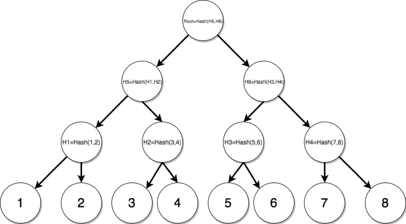
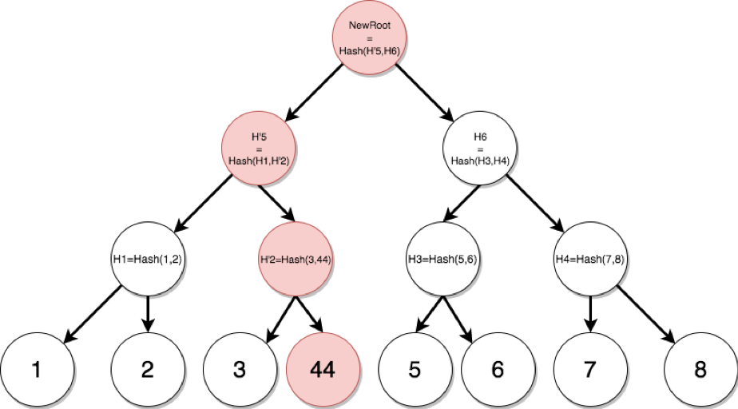
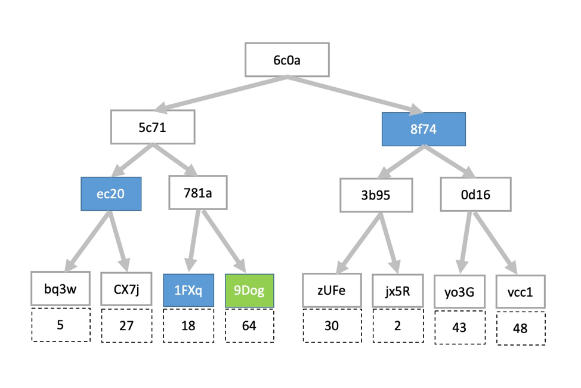

Merkle树和 Merkle证明
数据完整性是通信协议需要考虑的基本问题之一。 数据存储于硬盘中、将在网络中传输，应时时刻刻保证数据的完整性。区块链程序更是如此。

如果一组数据量不大的话，例如我们有 a1
、 a2
、 a3
三个数据要传输， 发送方可以用串联数据片段并执行哈希，得到一个校验值 h，如下所示。

h=hash(a1+a2+a3)

在收到数据后，接收方进行相同形式的串联，并按同样的哈希函数计算，比较哈希值是否一致就可知数据是否完整。

h′=hash(a1+a2+a3)

但这个思路存在一定的效率问题。

在于当数据量比较大时候，例如有 a1
、 a2
、 a3
… a100
的数据片段的时候， 我们往往分批传输这些小块，每次只要有一小部分数据损坏，整个数据校验和便无法对应上， 我们也不知道过程中哪个小块错误了，导致我们重传整组数据，这是非常耗时的。 如果能将数据进一步细分成小组，对小组做校验和，再将小组与小组组合成大组做校验和，将能方便地解决上述问题。

Merkle树是一个在密码学中常使用的树形结构，适用于解决数据完整性问题。 它的结构功能异常简单，通常我们用二叉树的形式来表示一棵 Merkle树， 它存在的作用是数据分组并保证数据在存储中的完整性。 例如一棵包含了数字 1 到 8 的 Merkle二叉树，如图 4-4 所示。

一棵包含了数字1到8的Merkle二叉树

在图中的 Merkle树里，我们一共持有8个基础数据， 1 到 8 ，它们两两分组形成最初的小组。

例如数据 1 与数据 2 ，它们分在一组中，并计算它们串联后的哈希值 H1=hash(1,2)
，

同理将数据 3 与数据 4 串联的串联哈希值计算为 H2
，依次类推，形成第二层的树中节点。

之后再将第二层的树中节点H1
~ H4
两两分组。例如 (H1
与H2
串联计算第三层的哈希值H5
)。

逐层聚合反复递归，执行哈希计算。直到的仅剩下一个哈希值节点：根节点哈希值 Root ，该过程完毕。

如果碰上基础数据集不是偶数个元素（例如仅有7个数据），则复制一个元素，让它与自己的双胞胎做哈希运算。

由此我们可以推论：Merkle树的树叶都是数据、树中的节点都是哈希值。

那么，Merkle树如何提升了校验效率呢？

Merkle树的精妙在于它将一个庞大的数据集分散成组。

在网络传输的过程中，仅需逐步传送各个小组，并执行组合校验，再逐步传送，直到拼接完成整个数据集。 过程中若有任何数据传送出差错，仅需重传那个小分组。 如果数据集中的一个值在传输中被损毁，会影响该数据所在的整个分支、子树、到根节点的哈希值，方便我们快速定位出错点。 如图 4-5 所示，我们修改数据4为44后，相应路径直到根节点哈希都会产生变化。

修改数据4为数据44后，相应的路径直到根节点哈希都发生了变化

Merkle树的应用场景在哪里呢？

Merkle树最实用的两个场景，其一是当比较两份大数据时，可以从根节点上就直接判断出两份数据是否相同（哪怕一个子数据不同，根节点的哈希值都不同）。

其二是可以做 “Merkle证明”，即在整棵树尚未 完整下载 的情况下，仅通过下载的部分数据来进行完整性校验，快速判断某数据小组是否在其应处的位置，举例如图 4-6 所示。

Merkle证明数据64有效存在于该棵树中

在这里我们有一组份数据包含了8个元素，依次是 [5,27,18,64,30,2,43,48] ，当我们在传输过程中收到了数据 64 ，我们如何才能在其他数据尚未送达之前，证明以下两点？：

数据 64 的确存在于这组组数据中。
数据 64 存在的位置是第4格（第四顺位）。
按照 Merkle证明 ，我们仅需知晓4个哈希值即可作出证明。

数字 64 的相邻数字 18 的哈希值 (图中为 1FXq)
相邻分组 [5, 27] 的联合哈希值 (图中为 ec20)
相邻分支的哈希值 (图中为 8f74)
根节点哈希值 (图中为 6c0a)
证明推导过程如下：

我们计算得出 64 的哈希值为 9Dog，将结果与哈希值 1FXq 串联，计算得出联合哈希值 781a。

重复上述过程，将 781a 与 ec20 串联，计算得出联合哈希值 5c71。

重复上述过程，将 5c71 与 8f74 串联，计算出根哈希值 6c0a。

若根哈希值与我们从数据发送方传来的值 6c0a 对比，相等，则证明完毕。

在整个校验过程中，我们并没有下载任何其他的数据，仅通过哈希值就能鉴别数据 64 的位置以及是否存在，是一种极其高效的方式，且可以横向扩展到任意大数量的数据集。